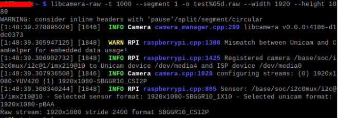
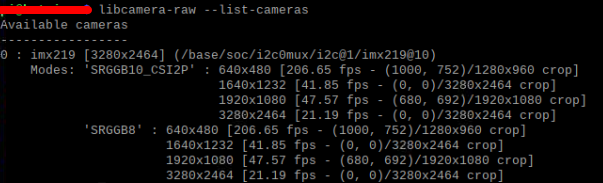
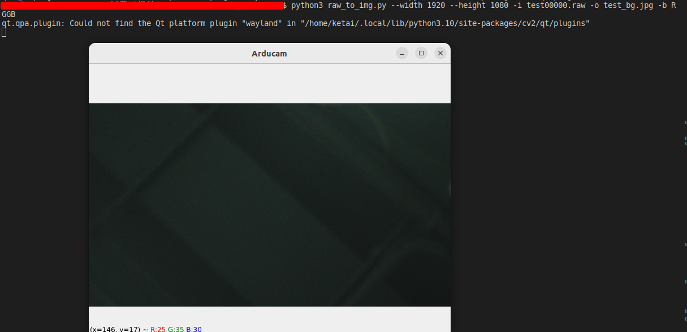

## RAW Conversion Tools

use `python raw_to_img.py -h` to display help.  


--

## Usage

### using libcamera-raw save data
```
libcamera-raw -t 1000 --segment 1 -o test%05d.raw --width 1920 --height 1080
```


### Check data type.
```
libcamera-raw --list-cameras
```


convert RAW10 to jpg:  
```
python3 raw_to_img.py --width 1920 --height 1080 -i test00001.raw -o test_bg.jpg -b RGGB
```


Enter 'q' from the keyboard to launch the program


The resolution of the Raspberry Pi has alignment rules, the width is a multiple of 32, and the height is a multiple of 16. 
If the resolution you choose does not meet the alignment requirements, you need to add the `--mipi-camera` parameter
